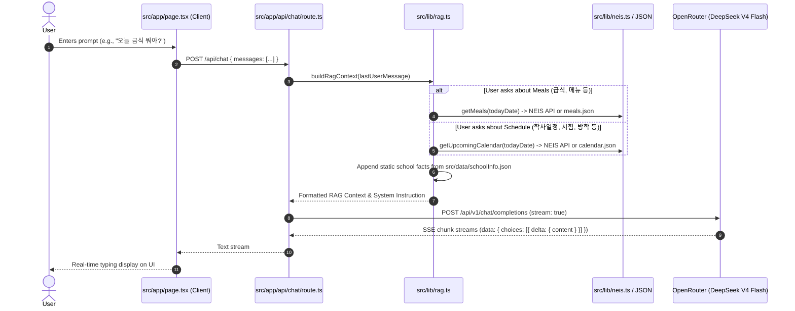

# AI & Developer Architecture Guide: Gimcheon Middle School AI Chatbot (`nextScChat`)

This document serves as an exhaustive technical reference for AI coding agents and human developers to understand the codebase structure, tech stack, data pipeline, and architecture of **nextScChat**.

---

## 1. Project Purpose & High-Level Summary
- **App Name**: `nextScChat` (Gimcheon Middle School AI Chatbot / 김천중학교 AI 안내 챗봇)
- **Objective**: An AI-powered chatbot website tailored specifically for Gimcheon Middle School (김천중학교) in South Korea. It answers student, parent, and visitor inquiries regarding school history/symbols (송설당 최송설헌 여사, 사수삼강), statistics (student/teacher counts), facilities, clubs, uniforms, admissions, academic calendar, and daily cafeteria meal menus (급식).
- **Core Design Philosophy**: Minimalist, clean white interface with responsive UX, ultra-low latency SSE token streaming, and hybrid RAG (dynamic live data + structured static knowledge base).

---

## 2. Technology Stack

| Layer | Technology | Details |
| :--- | :--- | :--- |
| **Framework** | Next.js 14 (App Router) | React Server & Client Components, Route Handlers |
| **Language** | TypeScript (Strict mode) | Strict type checking, path aliases (`@/*` -> `./src/*`) |
| **Styling** | Tailwind CSS + Autoprefixer | Minimalist white palette, responsive utility classes |
| **Icons** | Lucide React | Clean, tree-shakeable icons (`Utensils`, `Calendar`, etc.) |
| **Markdown** | `react-markdown` + `remark-gfm` | Formatted AI output (tables, lists, bold text, code blocks) |
| **LLM Provider** | OpenRouter API | `https://openrouter.ai/api/v1/chat/completions` |
| **Default Model** | DeepSeek V4 Flash | `deepseek/deepseek-v4-flash-0731` |
| **Data & RAG** | Hybrid Intent Routing + Fallback | NEIS Open API for live meals/schedule + JSON fallback |
| **Hosting Target**| Cloudflare Pages / GitHub | Zero-cold-start Edge/Serverless deployment |

---

## 3. Directory Structure & Key Files

```text
nextScChat/
├── public/
│   └── songseol_logo.png             # Official Gimcheon Middle School (Songseol) emblem
├── src/
│   ├── app/
│   │   ├── api/
│   │   │   └── chat/
│   │   │       └── route.ts          # Core streaming chat endpoint (OpenRouter SSE forwarder)
│   │   ├── globals.css               # Base CSS, typography, scrollbar styling
│   │   ├── layout.tsx                # Root layout with metadata and favicon
│   │   └── page.tsx                  # Main client-side chat interface (state, SSE reader)
│   ├── components/
│   │   ├── Header.tsx                # Minimalist top navigation bar with live status indicator
│   │   ├── ChatMessage.tsx           # Render message bubble with markdown & copy-to-clipboard
│   │   ├── QuickPrompts.tsx          # 6 quick-suggestion prompt chips for common queries
│   │   └── ChatInput.tsx             # Auto-resizing textarea with enter-to-submit
│   ├── data/
│   │   ├── schoolInfo.json           # School profile, student/teacher stats, facilities, history
│   │   ├── calendar.json             # 2026 academic calendar events (cached fallback)
│   │   └── meals.json                # 2026 daily meal menus with calories (cached fallback)
│   └── lib/
│       ├── neis.ts                   # NEIS Open API fetcher for live meals & calendar + fallback
│       └── rag.ts                    # Keyword intent router & prompt context builder
├── .env.example                      # Template for required environment variables
├── .env.local                        # Local secrets (Ignored in Git)
├── .gitignore                        # Git ignore rules
├── next.config.mjs                   # Next.js configuration
├── package.json                      # Dependencies and scripts
├── postcss.config.js                 # PostCSS setup with Tailwind & Autoprefixer
├── README.md                         # User-facing setup & deployment guide
└── tsconfig.json                     # TypeScript compiler configuration
```

---

## 4. RAG & Data Ingestion Flow



---

## 5. API Contracts & Conventions

### `POST /api/chat`
- **Request Format**:
  ```json
  {
    "messages": [
      { "role": "user", "content": "오늘 점심 메뉴 뭐야?" }
    ]
  }
  ```
- **Response**: `ReadableStream<Uint8Array>` (Plain text stream chunked with UTF-8 encoding).
- **Environment Variables**:
  - `OPENROUTER_API_KEY`: API key for OpenRouter (`sk-or-v1-...`).
  - `OPENROUTER_MODEL`: Model identifier (defaults to `deepseek/deepseek-v4-flash-0731`).
  - `NEIS_API_KEY`: Educational NEIS API key for live meal/calendar synchronization.

---

## 6. How to Extend or Modify

1. **Adding New School Data**:
   - Update `src/data/schoolInfo.json` with new categories or updated statistics.
   - The context builder in `src/lib/rag.ts` automatically incorporates these facts into the system instruction.
2. **Changing LLM Models / Providers**:
   - To change the OpenRouter model, adjust `OPENROUTER_MODEL` in `.env.local` or Cloudflare environment variables (e.g. `anthropic/claude-3.5-sonnet`, `openai/gpt-4o-mini`, `google/gemini-2.0-flash-001`).
3. **UI Customization**:
   - Header: `src/components/Header.tsx`
   - Quick Prompt Chips: `src/components/QuickPrompts.tsx` (edit the `PROMPTS` array)
   - Chat Bubble Styling: `src/components/ChatMessage.tsx`
